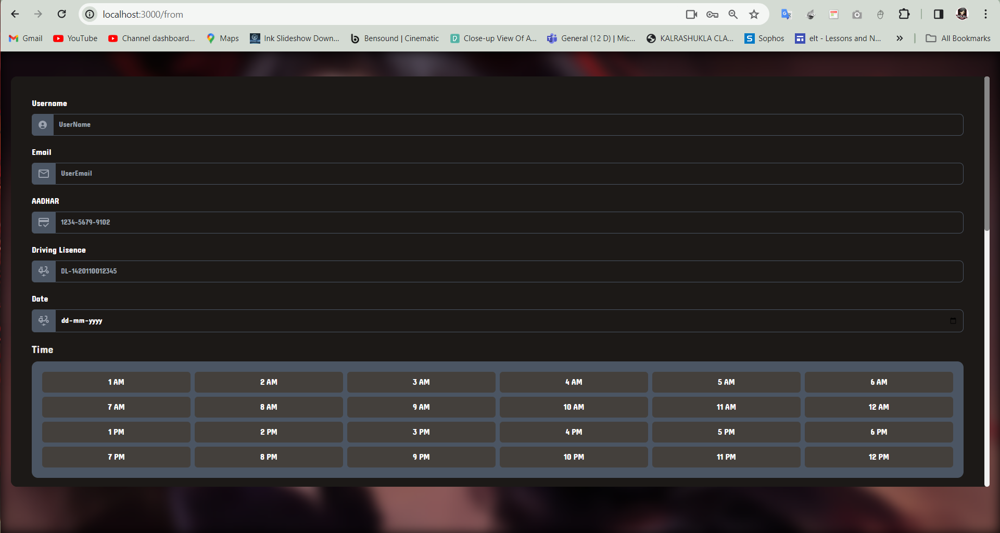

# E-Rentify: Next-Gen Vehicle Rental Platform

Welcome to E-Rentify, your one-stop solution for a seamless vehicle rental experience. This platform leverages advanced technologies like image processing and neural network-powered chatbots to offer a user-friendly and efficient service.


### Chatbot Assistance
The platform features a neural network-powered chatbot capable of natural and intuitive conversations, assisting users with queries and interactions.

## Screenshots

### Landing Page


### Login Page


### Authentication
E-Rentify employs a robust user authentication system to ensure secure access to the platform. We have integrated Google OAuth for a seamless and convenient login experience, allowing users to sign in using their Google accounts with just a few clicks. Additionally, we have implemented password hashing to enhance the security of user credentials. This means that user passwords are stored in an encrypted format, making it significantly harder for unauthorized parties to access sensitive information


### Sign-Up Page


### User Authentication
image processing technology authenticates users by matching freshly captured images with information.

To further ensure the authenticity of users, we have incorporated a registration form that includes an image input. This image is later used for facial authentication when a user requests a vehicle, confirming that the person making the request is indeed the registered user


### Dashboard


## Features

### Flexible Rental Plans
E-Rentify offers various rental plans to suit your needs:
- **1 Hour:** ₹59
- **6 Hours:** ₹600
- **12 Hours:** ₹900

Each plan provides a detailed list of benefits to ensure you get the best value for your money.

### Available Vehicles
Choose from a range of vehicles:
- **Arther 450**
  - Mileage: 45 km/h
  - Hourly Rent: ₹60
- **Arther 450X**
  - Mileage: 55 km/h
  - Hourly Rent: ₹100

### Vehicle Booking



### Trips Booking


### Success Booking


## Getting Started

### Prerequisites
- Node.js
- npm

### Installation

1. Clone the repository:
   ```bash
   git clone https://github.com/Big-Leu/tailwind.git
   cd tailwind
1. Install the dependency
    ```bash
   npm i 
   npm run dev
 
